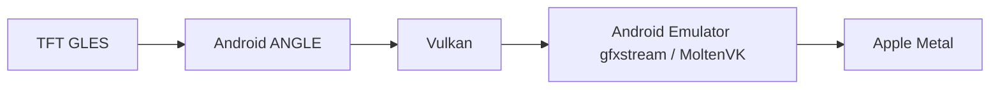
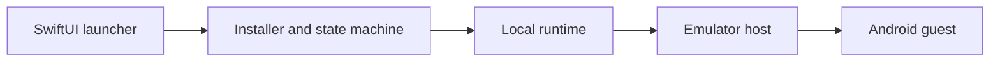

# Mactician

**A native, open-source TFT launcher for Apple Silicon.**

Mactician prepares and manages everything needed to play TFT on a modern
Mac—without Android Studio, Terminal commands, or manual configuration.

Created by [Sergei Naumov](https://sergeinaumov.dev/writing), a backend and
security platform engineer. Read my [technical writing](https://sergeinaumov.dev/writing/how-i-built-mactician) about this project
or connect with me on [LinkedIn](https://www.linkedin.com/in/sergei-naumov-dev/).

[Download Mactician](https://github.com/tweet9ra/mactician/releases/latest) ·
[Documentation](#documentation) ·
[Technical case study](https://sergeinaumov.dev/writing/how-i-built-mactician)

Built for two tacticians. Shared with everyone.


## Project status

- Version: **1.1.3** (build 48)
- Host architecture: **Apple Silicon (`arm64`)**
- Minimum deployment target: **macOS 12.0**, enforced by the build target and
  runtime preflight
- Status: **experimental, best effort**; there is no support or compatibility
  SLA
- Compatibility is pinned to TFT `18.1-5392842`, Android Emulator 37.1.11,
  and Android 36. A game or emulator update can require a new Mactician release.

## Preview


Mactician keeps launcher controls and the running TFT window side by side.
The native SwiftUI interface is localized in English and Russian; game language
is configured independently.

## Features

- Installs and verifies pinned Android Platform Tools, Emulator, and Google's
  official Android 36 Google Play system image.
- Verifies every downloaded component and bundled game split with SHA-256.
- Creates, provisions, starts, stops, repairs, and resets a dedicated AVD.
- Offers resolution, UI scale, Android RAM, vCPU, game-language, and three
  graphics-detail controls, including a reversible Maximum FPS profile.
- Preserves the local Android runtime, Riot sign-in, game data, and launcher
  preferences across full application updates.
- Repairs incomplete installs and a known zero-byte streaming-install cache
  without clearing unrelated app data.
- Provides game hotkeys for shop, reroll, XP, item/trait and player/damage tabs,
  plus the macOS window-fill shortcut.
- Uses a Sparkle appcast with Ed25519 archive verification for updates; public
  releases are Developer ID signed and Apple-notarized.
- Sends minimized activation events, a versioned one-time fresh census, and an
  unlinkable duration-only summary after every completed session; separately
  consented extended diagnostics remain optional. It can also display validated operator messages. See
  [Telemetry and privacy](docs/telemetry.md).
- Includes a disabled-by-default Native iPad Runtime proof of concept for
  validating and launching a separately prepared `.app` without acquiring,
  modifying, or signing it. Android remains the default and supported path.

## Requirements

### To run a release

- An Apple Silicon Mac with macOS 12.0 or later.
- At least 8 GB of system memory; 8 GB Macs use a reduced 4 GB Android guest.
- At least 25 GiB of free disk space for downloads, extraction, the AVD, TFT
  assets, and update headroom.
- Internet access to Google's Android repository and TFT services.
- A Google account is required to install or update applications through Play
  Store.
- Hypervisor Framework support, available on supported Apple Silicon Macs.
- Acceptance of the linked Android SDK terms during installation.
- Accessibility permission only if the built-in game hotkeys are used. The
  emulator itself does not need this permission.

### To build from source

Xcode Command Line Tools, zsh, `jq`, and four exact unmodified TFT APK
splits matching the release manifest are required. Node.js is needed only for
the optional Keychain-backed login helper. Developer ID credentials, a
notarytool Keychain profile, and a Sparkle Ed25519 key are release-only
requirements.

## Download and installation

When a public build is available, download the latest DMG from the repository's
[GitHub Releases page](https://github.com/tweet9ra/mactician/releases/latest).
Verify the version, build number,
and the SHA-256 published with that release before opening it.

1. Open the DMG and drag **Mactician** to **Applications**.
2. Open it. Version 1.1.3 is signed with Apple Developer ID and notarized, so
   Gatekeeper can verify it normally without **Open Anyway**.
3. Review and accept the Android SDK terms, then choose **Install**. About
   2.3 GB is downloaded before extraction and AVD provisioning.
4. Open **Google Play** in the Android window and sign in.
5. For the Vietnam client, install **Đấu Trường Chân Lý** from its
   [official Google Play listing](https://play.google.com/store/apps/details?id=com.riotgames.league.teamfighttacticsvn).
   Its package ID is `com.riotgames.league.teamfighttacticsvn`.
6. Open the installed game from Android. Mactician detects the Vietnam client
   first and uses the global TFT client as a fallback.

Applications, Play Store account data, and Android settings persist until
**Reset** is used. Closing TFT leaves Android running so another installed
application can be opened without rebooting the emulator.

Mactician-managed data stays in
`$HOME/Library/Application Support/Mactician`.

**Repair Installation** re-verifies components, refreshes Mactician-owned
runtime scripts, and reprovisions missing pieces while preserving the AVD and
Riot/game state. **Reset** deletes the complete launcher-managed data directory,
including the AVD, sign-in state, and game data, after confirmation.

## Build from source

Keep the four pinned APK files outside Git and point the build at their
directory. Their names and hashes are recorded in
[`launcher/Resources/release-manifest.json`](launcher/Resources/release-manifest.json).

### Unit tests and typecheck

```sh
./scripts/verify-repository.command
./scripts/test-mactician.command
```

The test script compiles unit tests for the current host architecture, checks C
syntax, validates release safeguards, runs the tests, and typechecks the full
Apple Silicon production source set.

### Local ad-hoc build

```sh
PROJECT_DIR="$PWD"
TFT_GAME_APK_DIR="$PROJECT_DIR/private/tft-apks" \
  ./scripts/build-mactician.command
```

This produces `dist/Mactician.app` and
`dist/Mactician-1.1.3.dmg`, signed ad hoc for local validation.

### Provisioning integration test

After a local build:

```sh
./scripts/integration-test-mactician.command
```

This test downloads the large pinned Android archives and provisions temporary
data, so it is not run on every pull request.

### Signed and notarized release

```sh
PROJECT_DIR="$PWD"
: "${MACTICIAN_CODESIGN_IDENTITY:?Set MACTICIAN_CODESIGN_IDENTITY in the environment}"
: "${MACTICIAN_NOTARY_PROFILE:?Set MACTICIAN_NOTARY_PROFILE in the environment}"
TFT_GAME_APK_DIR="$PROJECT_DIR/private/tft-apks" \
  ./scripts/build-mactician.command
```

Only environment-variable names belong in documentation or automation; never
commit identity secrets, passwords, private update keys, or notarization
credentials. See [Building](docs/building.md) and
[Releasing](docs/releasing.md) for the verified workflow.

Public releases use Developer ID signing, hardened runtime, Apple notarization,
and stapled tickets; local builds remain ad hoc by default.

## How it works

The game keeps its GLES interface while ANGLE and the emulator translate it to
Apple's graphics stack:



The application owns orchestration and local state; Google's emulator owns the
host/guest boundary:



## Performance research

Only reproducible or explicitly qualified results are treated as conclusions:

- In an exact stage-1-1 battle A/B, ASG measured **40.1 FPS / 34.85 ms p95**
  versus **29.6 FPS / 49.75 ms p95** on the old pipe transport.
- The selected GPU-scene/RHI/MoltenVK stack measured **36.0–36.8 FPS** in the
  later stage-1-5 scene.
- In a controlled stage-1-5 comparison, increasing source pixels from 1600×900
  to 2560×1440 by **2.56×** measured **30.5 versus 31.3 FPS**, showing no
  material loss in that CPU/RHI-bound scene. This does not generalize to every
  scene.
- MoltenVK-128 produced one promising **40.20 / 34.50 / 32.40 FPS** run at
  stages 1-2/1-5/1-8, but cold confirmation fell to
  **39.5 / 31.6 / 23.3 FPS**. It failed the reproducibility threshold and remains
  experimental.

See [Benchmarks](docs/benchmarks.md),
[Reproducibility](docs/reproducibility.md), and the
[Research log](docs/research-log.md) for methodology, rejected experiments, and
limitations. The focused
[native GLES and graphics-transport experiment](docs/native-gles-transport-experiment.md)
documents the shortened-path prototype, its ES 3.2 blockers, and the measured
current-path alternatives.

## Privacy and security

Runtime data, the AVD, downloads, and launcher logs remain local to the Mac.
After the first successfully completed game session, the launcher sends one
basic event containing a fresh event UUID, launcher version/build, calendar day,
and a rounded duration range. It contains no installation/device identifier,
exact duration or time, settings, language, or Mac characteristics. The metric
is reported as **Approximate activated installations**, not as users or people.

The launcher version that starts the fresh census sends one separate
`activation_snapshot` for snapshot version 1 per retained preferences domain.
It waits while the diagnostics choice is unknown, then contains only a fresh
event UUID, snapshot and consent versions, the explicit granted/denied state,
and launcher version/build. It is sent regardless of that choice and carries no
game-session diagnostics. The server keeps this new cumulative series separate
from the earlier, known-undercounted first-session metric.

After the updated telemetry notice is acknowledged, opening Mactician creates
at most one `daily_active` event per retained preferences domain and UTC day.
It contains only a fresh event UUID for that day, the UTC calendar day, and
launcher version/build. The server immediately aggregates it by that calendar
day without retaining the raw payload or source IP. The dashboard labels the
result **Approximate DAU** because separate macOS accounts or cleared
preferences can count again, while unavailable delivery can undercount.

Every completed session sends an independent anonymous summary containing only
a fresh event UUID, duration, and launcher version/build. It contains no date,
exact start/end time, stable identifier, device properties, or settings. The
server immediately aggregates session count and play time by received UTC day,
does not retain the raw payload or its source IP, and cannot link separate
sessions into an installation history.

With explicit opt-in only, every completed session additionally sends a separate
diagnostic event with exact duration, applied graphics/resource settings, Mac
model identifier, macOS version, total memory, and logical CPU count. Every
session has an independent event UUID and no installation ID. Turning the
setting off immediately deletes its local retry queue. Neither level contains a
Mac name, serial number, MAC address, Apple/Riot identity, logs, game state, or
AVD data. See [Telemetry and privacy](docs/telemetry.md) for the complete fields,
limitations, consent behavior, and retention periods.

The same HTTPS API can return a title, text, and optional PNG/JPEG for a popup
when the launcher starts or a game closes. Responses, redirects, image origin,
encoded size, MIME type, dimensions, and pixel count are checked before remote
content is shown.

Accessibility permission is used only for launcher hotkeys. A loopback-only
WebView DevTools connection performs a narrowly scoped login-field repaint
repair without reading or changing form values. Full raw game logs can contain
authentication-like data, so diagnostics must be filtered and sanitized before
sharing. Report vulnerabilities through the private process in
[SECURITY.md](SECURITY.md).

## Documentation

- [Architecture](docs/architecture.md)
- [Building](docs/building.md)
- [Releasing](docs/releasing.md)
- [Troubleshooting](docs/troubleshooting.md)
- [Benchmarks](docs/benchmarks.md)
- [Engineering case study](https://sergeinaumov.dev/writing/how-i-built-mactician)
- [Research log](docs/research-log.md)
- [Native GLES and graphics-transport experiment](docs/native-gles-transport-experiment.md)
- [Native iPad Runtime proof of concept](docs/native-ipad-runtime.md)
- [Native iPad Runtime validation record](docs/native-ipad-runtime-validation.md)
- [Reproducibility](docs/reproducibility.md)
- [Launch profiles](docs/launch-profiles.md)
- [Telemetry and privacy](docs/telemetry.md)

## Support

See [SUPPORT.md](SUPPORT.md).

## Contributing

See [CONTRIBUTING.md](CONTRIBUTING.md).

## License and attribution

Project code and documentation are available under the [MIT License](LICENSE).
Third-party notices and asset boundaries are documented in
[NOTICE.md](NOTICE.md).

Mactician is an independent community project and is not an official
Riot Games product.
